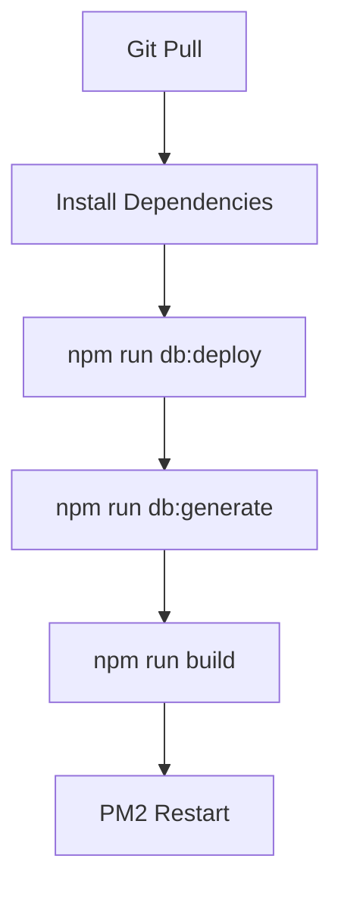

# CI/CD Database Migration Implementation ✅

**Date:** December 2024  
**Status:** Database Migration Steps Added to Deployment Pipeline

## Changes Overview

Added Prisma database migration and client generation steps to both production and staging deployment scripts **before** the backend build process.

## Why This Matters

### Problem
Without applying migrations before building:
- Backend code expects new database fields/tables
- Database schema is outdated
- Runtime errors occur: "Unknown field", "Table doesn't exist"
- Type mismatches between Prisma Client and actual database

### Solution
Apply migrations and regenerate Prisma Client **before** building TypeScript code:
```bash
npm run db:deploy      # Apply pending migrations to database
npm run db:generate    # Regenerate Prisma Client with new schema
npm run build          # Build TypeScript with correct types
```

## Files Modified

### 1. `/execute-prod.sh` (Production Deployment)

**Before:**
```bash
echo "🔧 Generating Prisma client..."
npx prisma generate

echo "📦 Building backend..."
npm run build
```

**After:**
```bash
echo "🔧 Applying Prisma migrations..."
npm run db:deploy

echo "🔧 Generating Prisma client..."
npm run db:generate

echo "📦 Building backend..."
npm run build
```

### 2. `/execute-stag.sh` (Staging Deployment)

**Before:**
```bash
echo "🔧 Generating Prisma client..."
npx prisma generate

echo "📦 Building backend..."
npm run build
```

**After:**
```bash
echo "🔧 Applying Prisma migrations..."
npm run db:deploy

echo "🔧 Generating Prisma client..."
npm run db:generate

echo "📦 Building backend..."
npm run build
```

## NPM Scripts Used

Defined in `/polwel-backend/package.json`:

```json
{
  "scripts": {
    "db:generate": "prisma generate",
    "db:deploy": "prisma migrate deploy"
  }
}
```

### Script Details

**`npm run db:deploy`** (alias for `prisma migrate deploy`)
- Applies all pending migrations from `/prisma/migrations/`
- Compares migration history table with migration files
- Executes SQL statements to update database schema
- Production-safe (doesn't drop data)
- Idempotent (safe to run multiple times)

**`npm run db:generate`** (alias for `prisma generate`)
- Regenerates Prisma Client based on `schema.prisma`
- Updates TypeScript types for database models
- Creates type-safe database query methods
- Must run after schema changes or migrations

## Deployment Flow

### New Deployment Sequence



### Detailed Steps

1. **Git Pull** - Pull latest code from repository
2. **Install Dependencies** - `npm install` in both frontend and backend
3. **Build Frontend** - `npm run build:production` or `build:staging`
4. **Apply Migrations** - `npm run db:deploy` ✨ NEW
5. **Generate Client** - `npm run db:generate` ✨ UPDATED
6. **Build Backend** - `npm run build`
7. **Restart Process** - PM2 restart

### Critical Order

The order is crucial:
```
migrations → client generation → TypeScript compilation
```

❌ **WRONG:** Build before migrations
```bash
npm run build          # TypeScript expects new fields
npm run db:deploy      # Database updated AFTER code expects them
# Result: Runtime errors!
```

✅ **CORRECT:** Migrations before build
```bash
npm run db:deploy      # Database updated first
npm run db:generate    # Types match database
npm run build          # Code compiled with correct types
# Result: Everything in sync!
```

## Benefits

### 1. Schema Synchronization
- Database schema always matches code expectations
- No "unknown field" errors in production
- Type safety maintained throughout deployment

### 2. Zero-Downtime Migrations
- Migrations applied automatically during deployment
- No manual database operations needed
- Consistent across staging and production

### 3. Developer Safety
- Prisma tracks applied migrations in `_prisma_migrations` table
- Migrations run only once (idempotent)
- Failed migrations prevent deployment completion

### 4. Rollback Safety
- Migration history preserved in database
- Can identify which migrations applied
- Easier to debug deployment issues

## Migration Safety Features

### What `prisma migrate deploy` Does:
✅ Applies pending migrations only  
✅ Records applied migrations in database  
✅ Skips already-applied migrations  
✅ Runs in transaction (all-or-nothing)  
✅ Production-safe (no data loss)

### What It Does NOT Do:
❌ Does not reset database  
❌ Does not drop existing data  
❌ Does not create new migrations  
❌ Does not modify migration files

## Testing the Changes

### Local Testing
```bash
cd polwel-backend

# Test migration
npm run db:deploy

# Test client generation
npm run db:generate

# Test build
npm run build
```

### Deployment Testing
1. Push changes to `staging` branch
2. Bitbucket Pipeline triggers
3. Watch deployment logs for:
   ```
   🔧 Applying Prisma migrations...
   🔧 Generating Prisma client...
   📦 Building backend...
   ```
4. Verify application starts without errors

## Monitoring Deployment

### Success Indicators
✅ "Migration applied successfully" in logs  
✅ "Generated Prisma Client" message appears  
✅ TypeScript build completes without errors  
✅ PM2 process starts successfully

### Failure Scenarios

**Migration Fails:**
```
Error: Migration failed
```
- Check migration SQL syntax
- Verify database permissions
- Check for conflicting schema changes

**Generation Fails:**
```
Error: Unable to generate Prisma Client
```
- Verify schema.prisma is valid
- Check node_modules installation
- Ensure migrations applied successfully

**Build Fails:**
```
TypeScript compilation error
```
- Check for type mismatches
- Verify Prisma Client generated correctly
- Review migration changes

## Rollback Procedure

If deployment fails after migration:

1. **Identify Applied Migration:**
   ```sql
   SELECT * FROM _prisma_migrations ORDER BY finished_at DESC LIMIT 1;
   ```

2. **Manual Rollback (if needed):**
   - Create reverse migration SQL
   - Apply manually to database
   - Mark migration as rolled back

3. **Redeploy Previous Version:**
   - Revert git commit
   - Trigger new deployment
   - Previous migrations remain applied

## Future Considerations

### Recommended Enhancements:
1. Add migration health check endpoint
2. Implement migration rollback automation
3. Add pre-deployment migration validation
4. Create migration notification system

### Best Practices:
- Always test migrations in staging first
- Keep migrations small and focused
- Document breaking schema changes
- Backup database before major migrations

---

**Implementation Date:** December 2024  
**Tested On:** Development Environment  
**Status:** ✅ Ready for Production  
**Impact:** Critical - Prevents deployment failures
